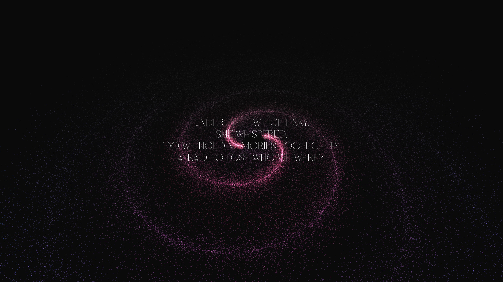

# Galaxy Visualization with Scroll Animations

Welcome to the Galaxy Visualization with Scroll Animations project! This is an immersive web-based 3D experience built using Three.js, featuring procedurally generated galaxy particle systems with smooth scroll-triggered animations. The project leverages GSAP for advanced animations, Lenis for smooth scrolling, and WebGL for rendering, creating an engaging cosmic journey through animated galaxies.

## Preview



## Features

* **Procedural Galaxy Generation**: Two distinct galaxy systems with customizable particle counts, sizes, colors, and spiral patterns using buffer geometry and shader materials.
* **Scroll-Triggered Animations**: GSAP ScrollTrigger powers smooth group rotations and position changes as users scroll through sections.
* **Smooth Scrolling**: Lenis integration provides buttery-smooth scroll behavior synchronized with Three.js animations.
* **Text Animations**: SplitText and GSAP create staggered word animations for section content with reverse playback on scroll up.
* **Responsive Design**: Full viewport height sections that adapt to different screen sizes.
* **Interactive Camera**: Smooth camera transitions from initial position to centered view using GSAP timelines.
* **Performance Optimized**: Efficient particle rendering with additive blending and fog effects for atmospheric depth.

## Prerequisites

* Node.js: v20.x (LTS) or later
* npm: Included with Node.js
* Web Browser: Modern browsers like Chrome, Firefox, or Edge
* Local Server: Required for development (Vite or similar)

## Installation

1. **Clone the Repository**

   ```bash
   git clone https://github.com/HarshitKumarSahu/galaxy
   cd galaxy
   ```

2. **Install Dependencies**

   ```bash
   npm install
   ```

   This installs Three.js, GSAP, Lenis, and other dependencies listed in package.json.

3. **Run the Project Locally**

   ```bash
   npm run dev
   ```

   Open your browser at the provided localhost URL (usually http://localhost:5173).

4. **Build for Production**

   ```bash
   npm run build
   ```

   The built files will be in the `dist` folder, ready for deployment.

## Usage

* **Initial Experience**: Click the start button to transition from the intro to the main scrollable sections.
* **Scroll Navigation**: Scroll through the sections to see galaxy group rotations and position animations.
* **Text Animations**: Section text elements animate in with staggered word effects, playing in reverse when scrolling up.
* **Galaxy Visualization**: Two procedurally generated galaxies rotate continuously, creating a mesmerizing cosmic backdrop.
* **Responsive**: The experience adapts to different screen sizes and orientations.

## Project Structure

```
├── src/
│   ├── script.js          # Main Three.js and animation logic
│   ├── style.css          # Styles for sections and UI
│   └── index.html         # Entry point with canvas and sections
├── package.json           # Dependencies and scripts
└── README.md              # This file
```

## Dependencies

* **Three.js**: Core 3D rendering engine for scene management, cameras, and particle systems
* **GSAP**: GreenSock Animation Platform for smooth scroll-triggered animations and text effects
* **Lenis**: Smooth scrolling library integrated with ScrollTrigger
* **SplitText**: GSAP plugin for word/character-level text animations

## Customization

### Galaxy Parameters

Modify the `galaxyInfo1` and `galaxyInfo2` objects in `script.js`:

```javascript
const galaxyInfo1 = {
    particleCount: 100000,      // Number of particles
    particleSize: 0.01,         // Size of each particle
    radius: 5,                  // Galaxy radius
    innerRadius: 0.3,           // Inner radius for spiral arms
    branches: 2,                // Number of spiral arms
    spin: 2.75,                 // Spiral tightness
    insideColor: "#7d0f25",     // Core color
    outsideColor: "#1b3984",    // Outer edge color
    // ... other parameters
}
```

### Animation Timing

Adjust ScrollTrigger parameters:

```javascript
scrollTrigger: {
    trigger: sections[0],
    endTrigger: sections[2],
    start: 'top top',
    end: 'bottom bottom',
    scrub: 1,                   // Animation speed relative to scroll
}
```

### Text Animations

Customize the `landingAnimation` function:

```javascript
return gsap.to(split[splitType], {
    y: 0,
    opacity: 1,
    duration: 1,                // Animation duration
    stagger: 0.05,              // Stagger between words
    ease: "expo.out",           // Easing function
})
```

### Section Layout

Edit `style.css` to modify section appearance, spacing, and typography.

## ScrollTrigger Configuration

The project uses multiple ScrollTrigger instances:

1. **Group Rotation**: Animates galaxy group rotation (x: π/4, y: 0.75π) across all sections
2. **Group Position**: Moves galaxy group (y: π, z: π) for depth effect
3. **Section 1 Text**: Fades out text when scrolling past initial section
4. **Section 3 Text**: Triggers new text animations at 50% viewport visibility

## Performance Tips

* Reduce `particleCount` for lower-end devices
* Adjust `scrub` values for smoother performance vs. responsiveness trade-off
* Use `gsap.ticker.lagSmoothing(0)` for consistent animation timing
* Consider LOD (Level of Detail) for complex particle systems

## Deployment

The project is optimized for static hosting platforms:

1. **Vercel**: Deploy directly from GitHub repository
2. **Netlify**: Drag and drop the `dist` folder or connect GitHub
3. **GitHub Pages**: Use `npm run build` and configure Pages to serve from `dist`

## Troubleshooting

* **Animations not triggering**: Ensure sections have proper height (100vh) and ScrollTrigger is registered
* **Galaxies not visible**: Check particle counts and material properties (size, blending)
* **Scroll not smooth**: Verify Lenis integration and `gsap.ticker` setup
* **Text animations broken**: Confirm SplitText plugin is loaded and DOM elements exist

## Acknowledgments

* **Three.js**: Core WebGL rendering foundation
* **GSAP**: Professional-grade animation system
* **Lenis**: Smooth scrolling implementation
* **Three.js Journey**: Inspiration for particle system techniques

## License

This project is open source and available on [GitHub](https://github.com/HarshitKumarSahu/galaxy). Feel free to fork, modify, and contribute!

---

*⭐ Star this repository if you found it helpful!*